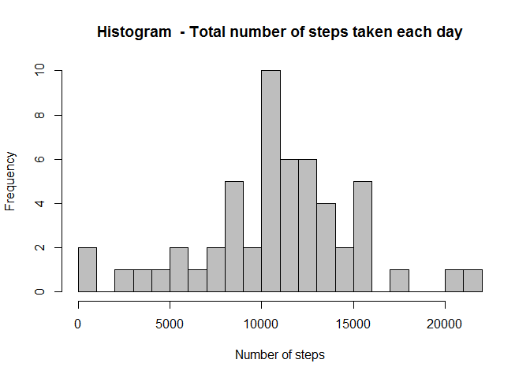
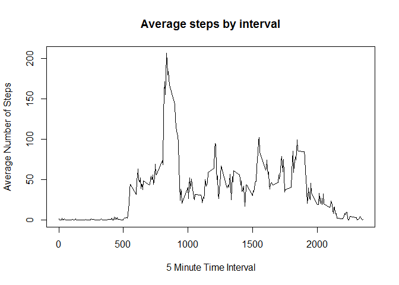
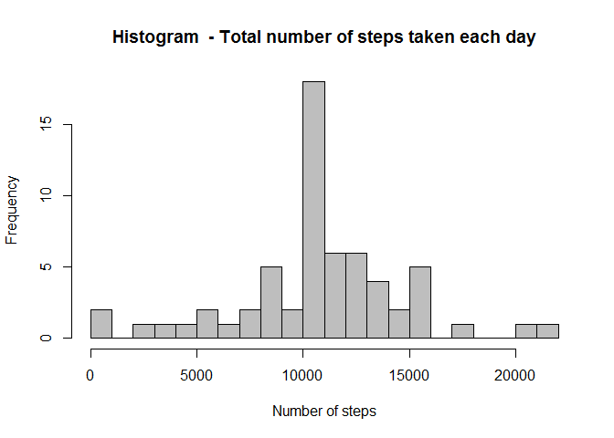

## Loading and preprocessing the data

Clearing the R environment:
```{r setup}

#Removes all env variables
rm(list=ls(all=TRUE))
```

Loading the data:

```{r load, echo = TRUE}
#Unzips the .zip file that was provided and reads it 
unzip("./activity.zip")
raw_data<- read.csv(file = "./activity.csv", header = T)
print(summary(raw_data))
```

The variables included in this dataset are:

steps: Number of steps taking in a 5-minute interval (missing values are coded as NA)

date: The date on which the measurement was taken in YYYY-MM-DD format

interval: Identifier for the 5-minute interval in which measurement was taken

The dataset is stored in a comma-separated-value (CSV) file and there are a total of 17,568 observations in this dataset.

## What is mean total number of steps taken per day?

Ignoring missing values for now, we will:

1. Calculate the total number of steps taken per day
2. Make a histogram of the total number of steps taken each day
3. Calculate and report the mean and median of the total number of steps taken per day

```{r hist, echo = TRUE, fig.path="./figure/",  fig.show = "hide"}
#Total of steps per day
steps_summary<- aggregate(steps ~ date, data = raw_data, sum)

#Plot the histogram
hist(x = steps_summary$steps, 
     breaks = 20,
     main = "Histogram  - Total number of steps taken each day",
     xlab = "Number of steps", 
     ylab = "Frequency", col = "grey")

#Calculate the mean and median of total number of steps per day
mean<- round(mean(x = steps_summary$steps, na.rm = T),1)
median<- round(median(x = steps_summary$steps, na.rm = T),1)
print(mean)
print(median)

```


## What is the average daily activity pattern?

Ignoring missing values, we will:

1. Make a time series plot (i.e. type = "l") of the 5-minute interval (x-axis) and the average number of steps taken, averaged across all days (y-axis)
2. Discover which 5-minute interval, on average across all the days in the dataset contains the maximum number of steps.

```{r timeseries, echo = TRUE, fig.path="./figure/", fig.show = "hide"}

#Summarize data
steps_summary_interval<- aggregate(x = raw_data$steps, by = list(raw_data$interval), FUN = mean, na.rm = T)

#Plot the time series
plot(steps_summary_interval, type = 'l',
    main = 'Average steps by interval',
    xlab = '5 Minute Time Interval',
    ylab = 'Average Number of Steps')
        
#Discover the interval wich contains the max number of steps
max_index<- which.max(x = steps_summary_interval[,2])
max_steps<- steps_summary_interval[max_index,2]
max_interval<- steps_summary_interval[max_index,1]


print(max_steps)
print(max_interval)
```


## Imputing missing values

We will:

1. Calculate and report the total number of missing values in the dataset (i.e. the total number of rows with NAs)
2. Create a new dataset that is equal to the original dataset but with the missing data filled in. We will use the interval's mean number of steps to replace the NAs
3. Make a histogram of the total number of steps taken each day and Calculate and report the mean and median total number of steps taken per day

```{r na_filling, echo=TRUE, fig.path="./figure/",  fig.show = "hide"}
#Calculate the number of rows with NAs
sum(is.na(raw_data$steps))

#Create a new dataset with filled values
filled_set <- raw_data
filled_set[is.na(filled_set)]<- ave(filled_set$steps, filled_set$interval,FUN = function(x) mean(x, na.rm = TRUE))[is.na(filled_set$steps)]

#Total of steps per day
filled_steps_summary<- aggregate(steps ~ date, data = filled_set, sum)

#Plot the histogram
hist(x = filled_steps_summary$steps, 
     breaks = 20,
     main = "Histogram  - Total number of steps taken each day",
     xlab = "Number of steps", 
     ylab = "Frequency", col = "grey")

#Calculate the mean and median of total number of steps per day
mean<- round(mean(x = filled_steps_summary$steps),1)
median<- round(median(x = filled_steps_summary$steps),1)

print(mean)
print(median)

````



We have observed that this second histogram has a similar shape, with increased frequencies, as expected. The mean and median values haven't changed because we calculated them ignoring NAs in the first place, and since the NAs were replaced with the mean, the average was not affected.  

## Are there differences in activity patterns between weekdays and weekends?

We will:

1. Create a new factor variable in the dataset with two levels - "weekday" and "weekend" indicating whether a given date is a weekday or weekend day.

2. Make a panel plot containing a time series plot (i.e. type = "l") of the 5-minute interval (x-axis) and the average number of steps taken, averaged across all weekday days or weekend days (y-axis). 

```{r weekday,  echo=TRUE, fig.path="./figure/", fig.show = "hide"}
#Add the day of the week variable to the dataset
raw_data$day<- weekdays(as.Date(raw_data$date))

#Create a factor function to determine Weekday/Weekend
factor_function<- function(x){
        if(x %in% c('Saturday', 'Sunday')){
                return('Weekend')
        }
        
        return('Weekday')
}

#Create the weekday/weekend factor variable with the factor function
raw_data$weekday<- as.factor(apply(as.matrix(raw_data$day), 1, factor_function))

#Summarize data by interval 
steps_summary_interval<- aggregate(x = raw_data$steps, by = list(raw_data$interval, raw_data$weekday), FUN = mean, na.rm = T)
colnames(steps_summary_interval)<- c("interval", "weekday", "steps")

#Plot the panels

library(lattice)


xyplot(steps ~ interval | weekday, data = steps_summary_interval,
      type = 'l',
      xlab = 'Interval',
      ylab = 'Number of Steps',
      layout = c(1,2))

```

 

As we observe, there are some differences in the number of steps when we break data by weekdays and weekend days. 

## Reproduction of this assessment's results

The raw data is available in this repository and all code for processing/plotting the data is provided as seen in each of the previous steps.